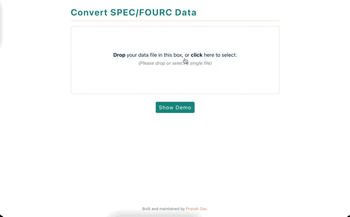

<h1 align="center">SUV App</h1>

This app can parse SPEC/FOURC formatted data, and export desired columns in
plaintext format. Alternatively, you can copy the parsed output to clipboard,
and directly paste in your favorite program (such as
Origin/<wbr/>Igor/<wbr/>Excel). Basic visualization of the data is also
available. The app is named after the SUV Beamline of Singapore Synchrotron
Light Source.

### Quick start

Visit the app page <https://suv.netlify.app>. Just drag and drop (or browse and
select) your data file, the app will guide you through its steps (i.e., select
scan number → select columns that you want to export etc.). Once you have set
all necessary options, click the **Process data** button, and you will be
presented with output data table. You can also view plot of your data (`x` vs
`y` column). If you data resembles 2-dimensional map data, the app can produce
3D surface plot along with 2D contours for quick visualization. A sample data
file is available [here](https://suv.netlify.app/data.txt).

### Privacy

This is a client side application. All data are processed in your device
locally. Your data is never sent over to any remote server. Once the webapp is
loaded in the browser memory, you do not require internet connectivity to
process data per se. However, note that not every module is loaded during the
first page loading; they are loaded on-demand. For example, if you use the plot
functionality, internet connectivity is necessary to dynamically load required
modules during their first call.

If you spot any bug or have suggestions to improve the application, please file
an [issue](https://github.com/pranabdas/suvapp/issues). Thank you.
